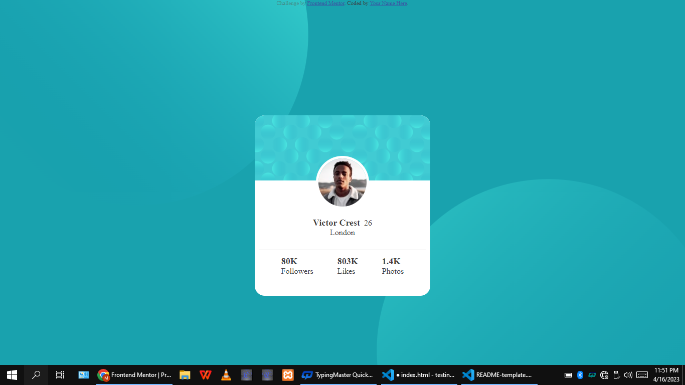

# Frontend Mentor - Profile card component solution

This is a solution to the [Profile card component challenge on Frontend Mentor](https://www.frontendmentor.io/challenges/profile-card-component-cfArpWshJ). Frontend Mentor challenges help you improve your coding skills by building realistic projects.

## Table of contents

- [Screenshot](#screenshot)
- [Links](#links)
- [Built with](#built-with)
- [Continued development](#continued-development)
- [Author](#author)

### Screenshot

### Links

- Live Site URL: [Add live site URL here](https://www.prince-coder10.github.io/profile)

## My process

### Built with

- Semantic HTML5 markup
- CSS custom properties
- Flexbox
- CSS Grid

### Continued development

There's lot of room for improvement and i would like to improve on various  
varying from HTML to CSS

## Author

- Frontend Mentor - [@prince-coder10](https://www.frontendmentor.io/profile/prince-coder10)
